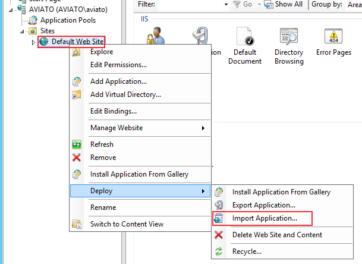
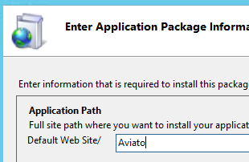
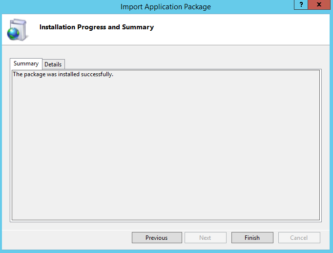
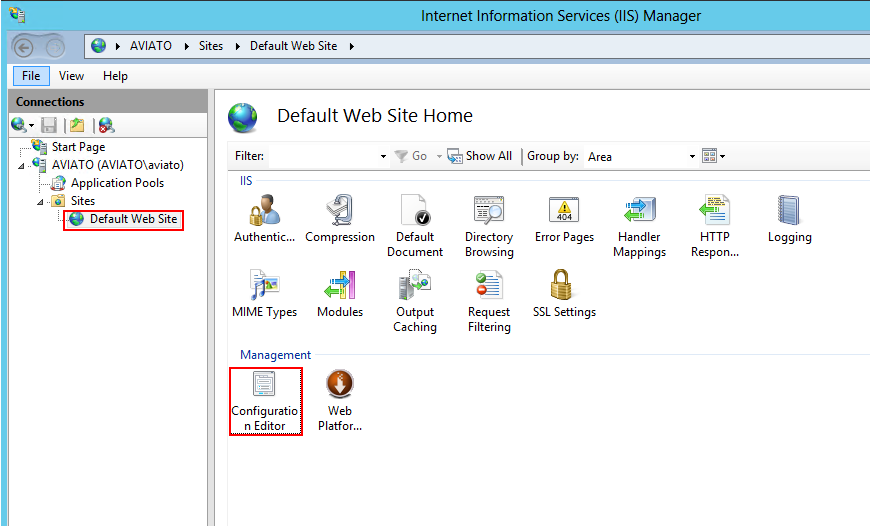
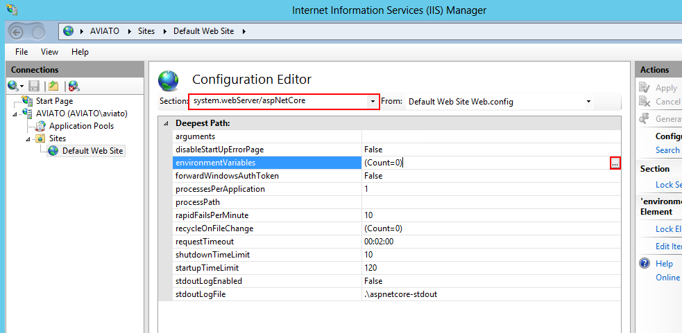
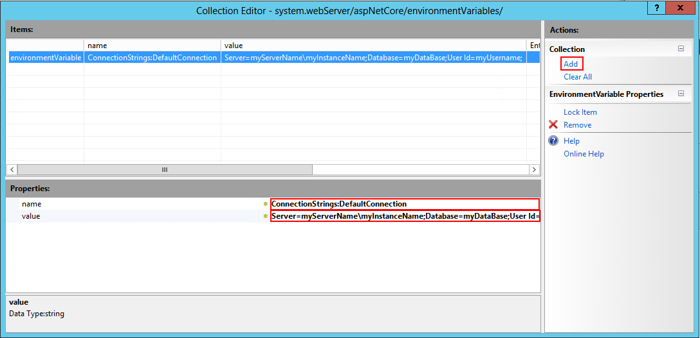

# Individual Environment Setup Using IIS

This system uses two services interlinked heavily and depending on each other.

## Prerequisite

- [.NET]()
- [Web Deploy](https://www.microsoft.com/en-us/download/details.aspx?id=39277)
- [URL rewrite module for IIS](https://www.iis.net/downloads/microsoft/url-rewrite)
- [Latest LTS node.js build for Windows](https://nodejs.org/en/download/)
- [IISNODE](https://github.com/Azure/iisnode/releases)

## Installing

These following steps are for deploying a general application. In the sub sections the two different services will list specific settings.

1. Create a Application Pool.
   - Choose "No Managed Code" as the .NET CLR version. And click OK


2. Select the website to deploy to (you might want to create a new one)
3. Right click and in select Deploy > Import Application



4. Select the zip package abd press next
5. Leave the default selection of contents and press next
6. Enter the name of the application in the section for "paramter 1"



7. The following dialog should show up confirming that the site was successfully published



8. A successful deploy should result in a web.config file (along with many other files) are located in the applications physical directory.

### Configure

1. Open the ConfigurationEditor



2. Select system.webServer/aspNetCore from the Section dropdown



3. Click environmentVariables and click on the ellipses next to it to open the configuration editor.
4. Add the necessary configuration. The table below describes the configuration keys.



### Frontend

Install the `frontend.zip` bundle.

This service is a Node service that serves all routes through the Next library router.
A `web.config` is provided for Windows Server hosting using [iisnode](https://github.com/Azure/iisnode).

To get started simply just install the bundle and be sure to overwrite any existing files. The builds are incremental,
meaning they shouldn't conflict with dirty or busy files during deployment. But for safety reason it is advised to shut down the container while uploading the package.

#### Environment Variables

| Name        | Description                                                                         | ExampleValue           |
| ----------- | ----------------------------------------------------------------------------------- | ---------------------- |
| BACKEND_URL | The origin and pathname of the backend service main entrypoint. (remember protocol) | http://localhost:45333 |

**NB**: After updating any environment variable you should reset all the containers for the service in order to take effect.

### Backend

Install the `backend.zip` bundle.

This service is a .NET 5 service. This application needs to be executed by the dotnet process, which comes with any .NET 5 runtime.
Install the backend bundle and it should be good to go. In case of a manual start process target the `Web.dll` with the `dotnet Web.dll`.

The deployment can cause dirty or busy files, so the container should be shut down for at least 1 minute (application caching rules) before installing the bundle.

#### Environment Variables

| Name                                | Description                                                                             | ExampleValue                                                                                                |
| ----------------------------------- | --------------------------------------------------------------------------------------- | ----------------------------------------------------------------------------------------------------------- |
| ConnectionStrings:DefaultConnection | Database Connection String. User should have full owner permission of the database.     | Server=(localdb)\\mssqllocaldb;Database=DKGartneriDev;Trusted_Connection=True;MultipleActiveResultSets=true |
| SuperUser:Username                  | The first initial user to be seeded into the database                                   | admin@danskgartneri.dk                                                                                      |
| SuperUser:Password                  | The first time password of the above user. Can be changed in the application following. | PasswordTilSeedingAfAdmin                                                                                   |
| MailSettings:Mail                   | From email in the SMTP client                                                           | noreply@danskgartneri.dk                                                                                    |
| MailSettings:DisplayName            | From email's pretty name in the SMTP client                                             | Dansk Gartneri                                                                                              |
| MailSettings:Username               | SMTP username                                                                           | smptuser1                                                                                                   |
| MailSettings:Password               | SMTP password                                                                           | SuperStrongPassword                                                                                         |
| MailSettings:Host                   | SMTP host                                                                               | 192.0.0.1                                                                                                   |
| MailSettings:Port                   | SMTP port (default 587)                                                                 | 587                                                                                                         |
| MailSettings:BaseUrl                | Url that the email redirects to (should be frontend url)                                | http://localhost:3000                                                                                       |
| SignOptions:Key                     | Penneo Key                                                                              | 123asd123                                                                                                   |
| SignOptions:Secret                  | Penneo Secret matching Key                                                              | asd123asd                                                                                                   |
| SignOptions:Endpoint                | Penneo API endpoint                                                                     | https://sandbox.penneo.com/api/v3/                                                                          |
| Statements:SigningSuccessUrl        | ...                                                                                     | http://localhost:3000/processingsignoff                                                                     |
| Statements:SigningFailureUrl        | ...                                                                                     | http://localhost:3000/processingsignoff                                                                     |
| Statements:ClientSigningPdfPath     | ...                                                                                     | ./Resources/dummy.pdf                                                                                       |

**NB**: After updating any environment variable you should reset all the containers for the service in order to take effect.

### CORS

If the webserver doesn't support CORS injection a environment variable has been made to suit this need. Do not use this if the webserver supports CORS injection!

| Name          | Description                                                 | Example               |
| ------------- | ----------------------------------------------------------- | --------------------- |
| Cors:Origin:0 | The Origin of an app that requires CORS with authentication | http://localhost:3000 |

## Resources

### WHATWG URL

Quick reference of the [WHATWG URL Standard.](https://url.spec.whatwg.org/)

```
┌────────────────────────────────────────────────────────────────────────────────────────────────┐
│                                              href                                              │
├──────────┬──┬─────────────────────┬────────────────────────┬───────────────────────────┬───────┤
│ protocol │  │        auth         │          host          │           path            │ hash  │
│          │  │                     ├─────────────────┬──────┼──────────┬────────────────┤       │
│          │  │                     │    hostname     │ port │ pathname │     search     │       │
│          │  │                     │                 │      │          ├─┬──────────────┤       │
│          │  │                     │                 │      │          │ │    query     │       │
"  https:   //    user   :   pass   @ sub.example.com : 8080   /p/a/t/h  ?  query=string   #hash "
│          │  │          │          │    hostname     │ port │          │                │       │
│          │  │          │          ├─────────────────┴──────┤          │                │       │
│ protocol │  │ username │ password │          host          │          │                │       │
├──────────┴──┴──────────┴──────────┴────────────────────────┤          │                │       │
│                          origin                            │ pathname │     search     │ hash  │
├────────────────────────────────────────────────────────────┴──────────┴────────────────┴───────┤
│                                              href                                              │
└────────────────────────────────────────────────────────────────────────────────────────────────┘
```
